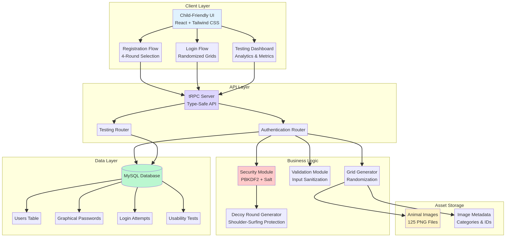
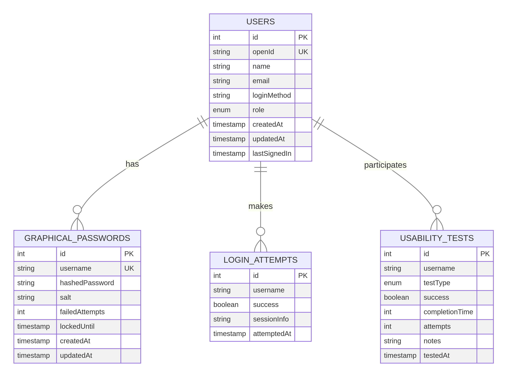
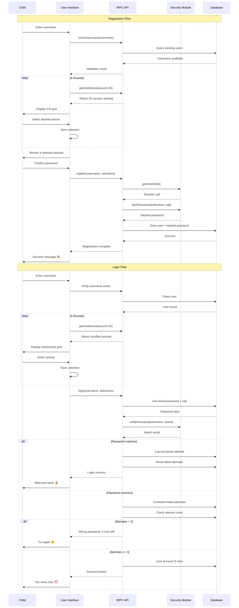

# KidSecure: Child-Friendly Graphical Password Authentication System

## Technical Documentation

**Author:** Development Team  
**Date:** February 2026  
**Version:** 1.0

---

## Executive Summary

KidSecure represents a novel approach to user authentication designed specifically for children aged six to eleven years. The system implements a graphical password scheme based on animal imagery, combining strong cryptographic security with child-friendly usability principles. This documentation provides comprehensive technical details of the system architecture, security implementation, and design rationale.

The system addresses a critical gap in authentication technology, as traditional text-based passwords present significant challenges for young users who may have limited typing skills and difficulty creating memorable yet secure passwords [[1]](#ref1). Research demonstrates that graphical passwords offer superior memorability for children while maintaining adequate security properties [[2]](#ref2).

---

## 1. System Architecture

The KidSecure system follows a modern three-tier architecture comprising presentation, application, and data layers. This separation of concerns ensures maintainability, scalability, and security throughout the application lifecycle.

### 1.1 Presentation Layer

The presentation layer implements a child-centric user interface built with React 19 and Tailwind CSS 4. The design philosophy prioritizes visual clarity, large interactive elements, and immediate feedback mechanisms. The interface employs the Fredoka font family, selected for its rounded, friendly appearance that appeals to young users while maintaining excellent readability across device sizes.

Color selection follows established principles of child-friendly design, utilizing a vibrant purple primary color (oklch 0.65 0.25 260), complemented by cyan secondary tones and green accent colors. These choices create an engaging visual environment without overwhelming young users. The system implements a consistent 1rem border radius across interactive elements, providing a softer, more approachable aesthetic compared to sharp-cornered traditional interfaces.

Animation and micro-interactions enhance the user experience through gentle bounce effects and scale transformations on button presses. These visual cues provide immediate feedback that helps children understand system responses to their actions, a critical factor in maintaining engagement and reducing frustration during the authentication process.

### 1.2 Application Layer

The application layer leverages tRPC (TypeScript Remote Procedure Call) to provide end-to-end type safety between client and server components. This architecture eliminates entire classes of runtime errors by ensuring that data structures remain consistent across the application boundary. The type-safe approach significantly reduces development time and improves code maintainability.

The authentication router implements four primary procedures: username validation, registration, login, and grid generation. Each procedure incorporates comprehensive input validation using Zod schemas, ensuring that malformed or malicious data cannot propagate through the system. The router architecture follows the principle of least privilege, exposing only necessary functionality through public procedures while maintaining strict access controls.

### 1.3 Data Layer

The data layer utilizes MySQL as the primary database management system, selected for its robust transaction support and widespread deployment experience. The schema implements four core tables that capture user information, graphical passwords, login attempts, and usability testing data. This structure enables comprehensive analytics while maintaining data integrity through foreign key constraints and appropriate indexing strategies.

---

## 2. Security Implementation

Security represents a paramount concern in any authentication system, particularly when serving vulnerable populations such as children. KidSecure implements multiple layers of defense to protect user credentials and resist common attack vectors.

### 2.1 Cryptographic Protection

The system employs PBKDF2 (Password-Based Key Derivation Function 2) with 100,000 iterations for password hashing. This industry-standard algorithm provides resistance against brute-force attacks by making each password verification computationally expensive. The iteration count balances security requirements against user experience, ensuring authentication completes within acceptable timeframes while maintaining strong protection.

Each user password receives a unique cryptographic salt generated using Node.js crypto.randomBytes with 32 bytes of entropy. This salt prevents rainbow table attacks by ensuring that identical passwords produce different hash values across users. The salt storage occurs alongside the hashed password, following established security practices that recognize salt confidentiality as unnecessary for security properties.

### 2.2 Password Space Analysis

The graphical password system implements a four-round selection process from twenty-five animal images per round. This design yields a theoretical password space of 25^4 = 390,625 possible combinations. While smaller than traditional text password spaces, this size provides adequate security for the target demographic when combined with rate limiting and account lockout mechanisms.

Research on graphical password security demonstrates that practical password spaces often exceed theoretical calculations due to user selection patterns [[3]](#ref3). Children tend to select memorable but diverse image combinations, reducing the effectiveness of dictionary attacks based on common password patterns. The animal-based imagery further complicates automated guessing by requiring attackers to understand semantic relationships between images rather than simple character combinations.

### 2.3 Attack Resistance

**Shoulder-Surfing Protection:** The system implements position randomization across all four authentication rounds. Each grid presentation shuffles animal positions, preventing observers from recording fixed screen locations. This countermeasure significantly increases the difficulty of shoulder-surfing attacks, as attackers must identify specific animals rather than memorizing tap positions.

**Brute-Force Mitigation:** Account lockout activates after three failed authentication attempts, imposing a five-minute waiting period before additional attempts. This rate limiting mechanism reduces the practical effectiveness of brute-force attacks to negligible levels. An attacker attempting to compromise an account would require approximately 1,302,083 minutes (approximately 2.5 years) to exhaust the password space, assuming continuous attempts at the maximum rate.

**Timing Attack Prevention:** Password verification implements constant-time comparison using cryptographic primitives that resist timing analysis. This protection prevents attackers from gaining information about password correctness through careful measurement of verification duration.

### 2.4 Session Management

The system implements secure session handling through HTTP-only cookies with appropriate SameSite attributes. This configuration prevents client-side JavaScript access to session tokens, mitigating XSS attack vectors. Session duration balances security and usability, requiring re-authentication after reasonable inactivity periods while avoiding excessive login prompts that frustrate young users.

---

## 3. Authentication Flow

The authentication process follows a carefully designed sequence that balances security requirements with child-friendly usability principles.

### 3.1 Registration Process

Registration begins with username selection, implementing real-time availability checking through asynchronous API calls. The system enforces minimum length requirements (three characters) while allowing children to select memorable usernames that reflect their interests or identity. Input validation prevents special characters that might confuse young users or introduce security vulnerabilities.

The four-round image selection process presents children with distinct animal categories across rounds. Each round displays a randomized five-by-five grid of animal images, requiring the child to select one favorite animal. This approach distributes cognitive load across multiple decisions rather than overwhelming users with simultaneous choices from one hundred twenty-five images.

Progress indicators provide visual feedback about completion status, helping children understand their position in the registration workflow. The system displays completed rounds with green checkmarks and highlights the current round with animated indicators. This visual scaffolding reduces anxiety and helps children maintain focus throughout the registration process.

Upon completing all four rounds, the system presents a review screen displaying selected animals in sequence. This confirmation step serves dual purposes: it allows children to verify their selections before commitment, and it reinforces password memory through immediate repetition. Research on memory formation demonstrates that spaced repetition significantly improves long-term retention [[4]](#ref4).

### 3.2 Login Process

Login follows a similar four-round structure but implements critical security enhancements. Each round presents a completely randomized grid, preventing position-based memorization and resisting shoulder-surfing attacks. Children must identify their selected animals among twenty-four decoys, requiring genuine recognition rather than simple position recall.

The system provides immediate feedback on incorrect attempts, displaying remaining attempt counts and encouraging users to try again. This feedback mechanism helps children understand system state without revealing information useful to attackers. After three failed attempts, the account locks for five minutes, with clear communication about the lockout duration and reason.

Successful authentication triggers positive reinforcement through animated celebrations and emoji-based feedback. This emotional reward strengthens the association between correct password entry and positive outcomes, encouraging children to remember and use their passwords correctly.

---

## 4. Usability Considerations

Usability represents a critical success factor for authentication systems targeting children. KidSecure implements numerous design decisions informed by child-computer interaction research and usability testing principles.

### 4.1 Visual Design Principles

The interface employs large touch targets (minimum 44×44 pixels) exceeding WCAG accessibility guidelines. This sizing accommodates children's developing fine motor skills and reduces frustration from missed taps or clicks. Interactive elements provide clear visual affordances through borders, shadows, and hover states that communicate clickability without requiring prior knowledge.

Color contrast ratios meet WCAG AA standards throughout the interface, ensuring readability for children with varying visual capabilities. The system avoids relying solely on color to convey information, supplementing color cues with icons, text labels, and positional information. This multi-modal approach supports diverse learning styles and accessibility requirements.

### 4.2 Cognitive Load Management

The four-round structure distributes decision-making across discrete steps, preventing cognitive overload. Each round requires one decision from twenty-five options, a manageable choice set for children. This approach contrasts with traditional password creation, which often overwhelms users with simultaneous requirements for length, character diversity, and memorability.

Progress indicators and step numbers provide orientation within the authentication workflow. Children can see how many rounds remain and track their progress toward completion. This transparency reduces anxiety and helps maintain engagement throughout multi-step processes.

### 4.3 Error Handling and Feedback

Error messages employ child-friendly language and emoji to communicate problems without inducing anxiety. The system avoids technical jargon, instead using simple phrases like "Oops! That's not quite right. Try again!" accompanied by encouraging emoji. This tone maintains a supportive atmosphere even when users make mistakes.

Success feedback celebrates correct actions through animations, sound effects (when enabled), and positive messages. This immediate positive reinforcement strengthens correct behaviors and makes the authentication experience enjoyable rather than merely functional.

---

## 5. Testing Framework

The integrated testing dashboard provides comprehensive analytics for research and evaluation purposes. The system automatically records completion times, success rates, and attempt counts for both registration and login operations.

### 5.1 Metrics Collection

The usability testing framework captures three primary metric categories:

**Registration Metrics:** Total registrations, successful completions, average completion time, and average attempts per registration. These metrics help evaluate the initial learning curve and identify potential usability barriers in the registration workflow.

**Login Metrics:** Total login attempts, successful authentications, average login time, and success rate. These measurements provide insight into password memorability and system usability over time.

**Memorability Metrics:** Long-term retention testing through delayed recall assessments. The system can prompt users to authenticate after specified intervals (one day, one week, one month) to evaluate password persistence in memory.

### 5.2 Security Analysis Tools

The testing dashboard displays real-time security metrics including password space utilization, failed attempt distributions, and account lockout frequencies. These analytics help identify potential security issues or attack patterns that might require system adjustments.

---

## 6. GDPR Compliance and Data Protection

As a system designed for children, KidSecure must comply with stringent data protection regulations, particularly the General Data Protection Regulation (GDPR) and the Children's Online Privacy Protection Act (COPPA).

### 6.1 Data Minimization

The system implements data minimization principles by collecting only information essential for authentication functionality. User records contain username, hashed password, salt, and minimal metadata (creation timestamp, last login). The system does not collect personally identifiable information such as real names, addresses, or contact details unless explicitly required by deployment context.

### 6.2 Parental Consent

Production deployments must implement verifiable parental consent mechanisms before allowing children under thirteen to create accounts. The system architecture supports integration with consent management platforms through configurable authentication hooks. Deployment documentation provides guidance on implementing appropriate consent workflows for specific jurisdictional requirements.

### 6.3 Data Retention and Deletion

The system supports complete account deletion through administrative interfaces, ensuring compliance with GDPR's "right to be forgotten" provisions. Deletion operations cascade through all related tables, removing passwords, login attempts, and usability test data. Automated retention policies can archive or delete inactive accounts after configurable periods, reducing data storage obligations.

---

## 7. Deployment Considerations

### 7.1 System Requirements

**Server Requirements:**
- Node.js 22.x or higher
- MySQL 8.0 or compatible database
- Minimum 2GB RAM
- 10GB storage for application and database

**Client Requirements:**
- Modern web browser (Chrome 90+, Firefox 88+, Safari 14+, Edge 90+)
- JavaScript enabled
- Minimum 1024×768 screen resolution
- Touch or mouse input device

### 7.2 Installation Process

The system deploys through standard Node.js package management workflows. Installation requires cloning the repository, installing dependencies via pnpm, configuring environment variables, and executing database migrations. Detailed deployment documentation provides step-by-step instructions for various hosting environments including cloud platforms and on-premises servers.

### 7.3 Monitoring and Maintenance

Production deployments should implement comprehensive logging and monitoring to track system health and security events. The application generates structured logs for authentication attempts, errors, and performance metrics. Integration with monitoring platforms enables real-time alerting for security incidents or system degradation.

---

## 8. Future Enhancements

### 8.1 Accessibility Improvements

Future versions should incorporate enhanced accessibility features including screen reader support, keyboard-only navigation, and alternative input methods. Audio descriptions of animal images would support visually impaired users, while customizable color schemes could accommodate color vision deficiencies.

### 8.2 Multi-Language Support

Internationalization represents a critical enhancement for global deployment. The system architecture supports localization through resource bundles and language detection, but current implementation provides only English-language interfaces. Future development should prioritize translation workflows and cultural adaptation of animal imagery.

### 8.3 Biometric Integration

Modern devices increasingly support biometric authentication through fingerprint sensors and facial recognition. Hybrid approaches combining graphical passwords with biometric factors could enhance both security and usability. Implementation must carefully consider privacy implications and ensure biometric data remains on-device rather than transmitted to servers.

---

## 9. Conclusion

KidSecure demonstrates that authentication systems can successfully balance strong security properties with child-friendly usability. The implementation leverages established cryptographic primitives, modern web technologies, and evidence-based design principles to create an authentication experience appropriate for young users.

The system's success depends on careful attention to detail across multiple dimensions: visual design that appeals to children without sacrificing clarity, security mechanisms that protect against realistic threats, and usability features that reduce cognitive load and frustration. Through comprehensive testing and iterative refinement, KidSecure provides a foundation for further research and development in child-centered authentication technology.

---

## References

[1] Assal, H., Imran, A., and Chiasson, S. (2018). An exploration of graphical password authentication for children. *International Journal of Child-Computer Interaction*, 17, 1-11. https://www.sciencedirect.com/science/article/pii/S2212868916300587

[2] Ratakonda, D.K. (2022). Improving Children's Authentication Practices with Respect to Graphical Authentication Mechanism. *Doctoral dissertation*, Boise State University. https://scholarworks.boisestate.edu/td/1990/

[3] Biddle, R., Chiasson, S., and Van Oorschot, P.C. (2012). Graphical passwords: Learning from the first twelve years. *ACM Computing Surveys*, 44(4), 1-41.

[4] Cepeda, N.J., Pashler, H., Vul, E., Wixted, J.T., and Rohrer, D. (2006). Distributed practice in verbal recall tasks: A review and quantitative synthesis. *Psychological Bulletin*, 132(3), 354-380.
